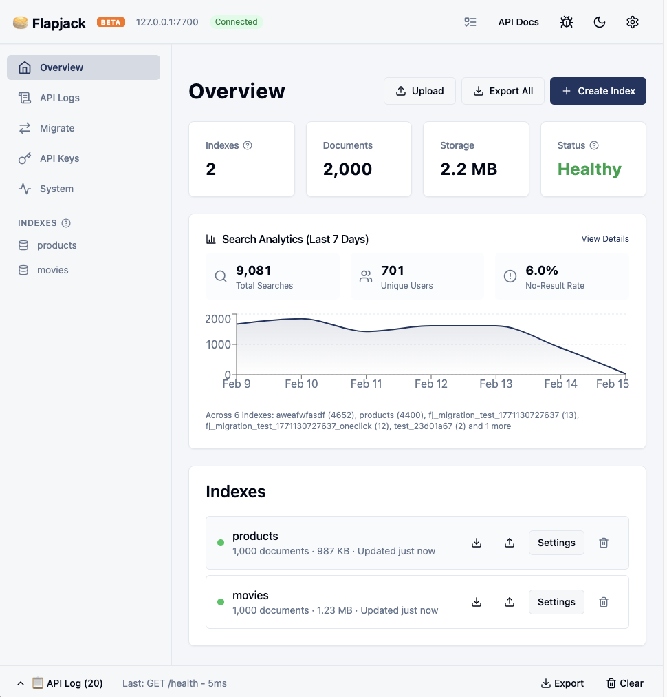
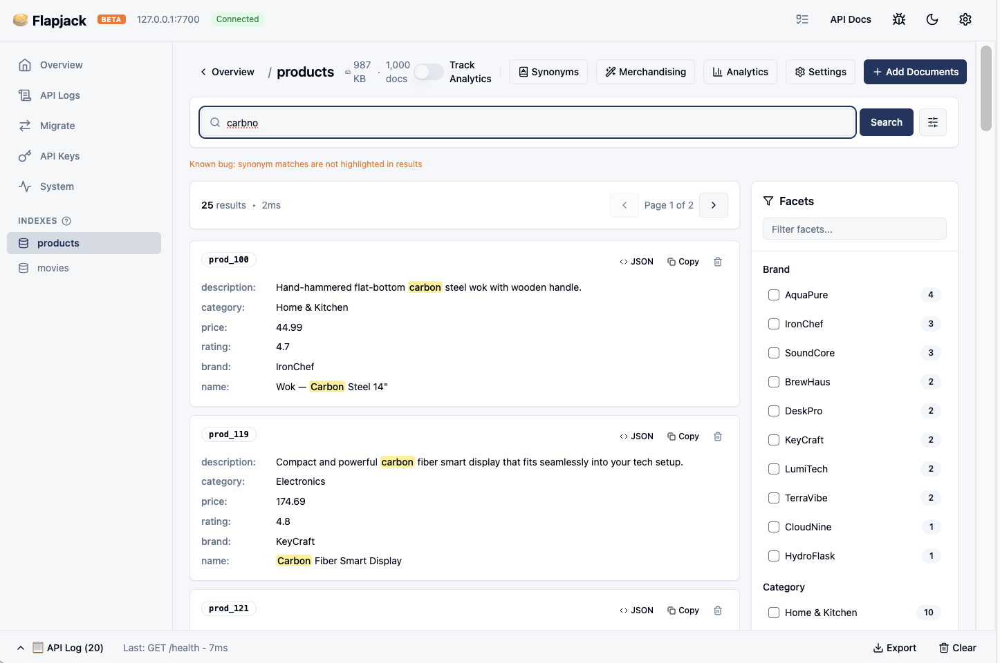
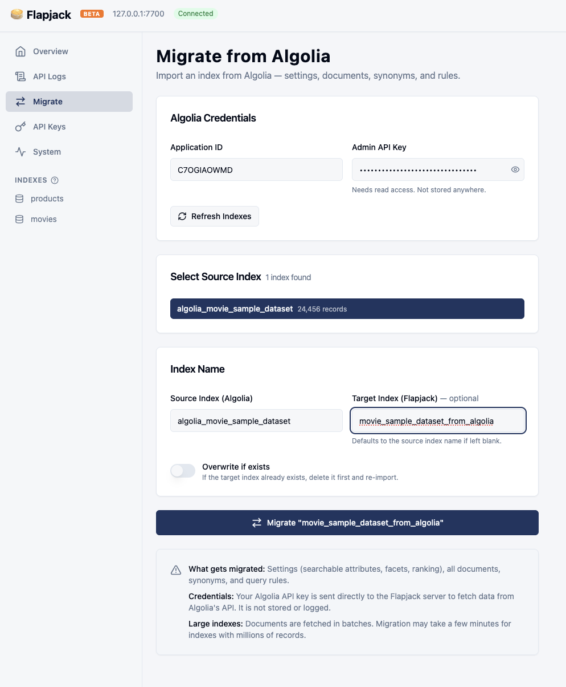

# 🥞 Flapjack 

[](https://github.com/gridlhq/flapjack/actions/workflows/ci.yml)
[](https://github.com/gridlhq/flapjack/releases)
[](LICENSE)

Drop-in replacement for [Algolia](https://algolia.com) — works with [InstantSearch.js](https://github.com/algolia/instantsearch) and the [algoliasearch](https://github.com/algolia/algoliasearch-client-javascript) client. Typo-tolerant full-text search with faceting, geo search, and custom ranking. Single static binary, runs anywhere, data stays on disk.

**[Live Demo](https://flapjack-demo.pages.dev)** · **[Geo Demo](https://flapjack-demo.pages.dev/geo)** · **[API Docs](https://flapjack-demo.pages.dev/api-docs)**

---

## Quickstart

```bash
curl -fsSL https://install.flapjack.foo | sh    # install
flapjack                                        # run the server
```

On first boot Flapjack generates an admin API key and prints it in the terminal.
Copy the key — you'll use it in the `X-Algolia-API-Key` header for all API requests.
The key is also saved to `data/.admin_key`.

Open the dashboard at **http://localhost:7700/dashboard** or use the API directly:

```bash
API_KEY="your-admin-key"   # printed on first boot

# Add documents
curl -X POST http://localhost:7700/1/indexes/movies/batch \
  -H "X-Algolia-API-Key: $API_KEY" \
  -H "X-Algolia-Application-Id: flapjack" \
  -H "Content-Type: application/json" \
  -d '{"requests":[
    {"action":"addObject","body":{"objectID":"1","title":"The Matrix","year":1999}},
    {"action":"addObject","body":{"objectID":"2","title":"Inception","year":2010}}
  ]}'

# Search (typo-tolerant — "matrxi" finds "The Matrix")
curl -X POST http://localhost:7700/1/indexes/movies/query \
  -H "X-Algolia-API-Key: $API_KEY" \
  -H "X-Algolia-Application-Id: flapjack" \
  -H "Content-Type: application/json" \
  -d '{"query":"matrxi"}'
```

These are the same Algolia-compatible `/1/` endpoints your frontend SDK will use — no separate "toy" API.

<details>
<summary>Note:</summary>

Binaries: [Releases](https://github.com/gridlhq/flapjack/releases/latest).

```bash
# Install specific version
curl -fsSL https://install.flapjack.foo | sh -s -- v0.2.0

# Custom install directory
FLAPJACK_INSTALL=/opt/flapjack curl -fsSL https://install.flapjack.foo | sh

# Skip PATH modification
NO_MODIFY_PATH=1 curl -fsSL https://install.flapjack.foo | sh
```

</details>

---

## Run Multiple Local Instances

For parallel local development, run each process with an isolated `data_dir`.
Flapjack now enforces this with a startup lock (`{data_dir}/.process.lock`).

```bash
# Derived isolated data dir + deterministic port:
flapjack --instance branch_a --no-auth

# Derived isolated data dir + OS-assigned port:
flapjack --instance branch_b --auto-port --no-auth

# Fully explicit:
flapjack --data-dir /tmp/fj/agent_a --bind-addr 127.0.0.1:18110 --no-auth
flapjack --data-dir /tmp/fj/agent_b --bind-addr 127.0.0.1:18111 --no-auth

# Agent helper scripts (tracked PID/log + explicit instance identity):
engine/_dev/s/start-multi-instance.sh agent_a --auto-port --no-auth
engine/_dev/s/start-multi-instance.sh agent_b --auto-port --no-auth
engine/_dev/s/stop-multi-instance.sh agent_a
engine/_dev/s/stop-multi-instance.sh agent_b
```

Never share the same `--data-dir` across concurrent processes.
`--auto-port` overrides env bind settings (`FLAPJACK_BIND_ADDR` / `FLAPJACK_PORT`) and only conflicts with explicit `--bind-addr` or `--port`.

For parallel local branch development, set per-clone test ports in repo root:

```bash
cp flapjack.local.conf.example flapjack.local.conf
# then edit FJ_BACKEND_PORT / FJ_DASHBOARD_PORT per clone
```

Dashboard Playwright/Vite config and `_dev` test runners read this file, so each clone can run its own isolated backend + dashboard test stack.

---

## Migrate from Algolia

```bash
flapjack

curl -X POST http://localhost:7700/1/migrate-from-algolia \
  -H "X-Algolia-API-Key: $API_KEY" \
  -H "X-Algolia-Application-Id: flapjack" \
  -H "Content-Type: application/json" \
  -d '{"appId":"YOUR_ALGOLIA_APP_ID","apiKey":"YOUR_ALGOLIA_ADMIN_KEY","sourceIndex":"products"}'
```

Search:

```bash
curl -X POST http://localhost:7700/1/indexes/products/query \
  -H "X-Algolia-API-Key: $API_KEY" \
  -H "X-Algolia-Application-Id: flapjack" \
  -H "Content-Type: application/json" \
  -d '{"query":"widget"}'
```

Then point your frontend at Flapjack instead of Algolia:

```javascript
import algoliasearch from 'algoliasearch';

// app-id can be any string, api-key is your FLAPJACK_ADMIN_KEY or a search key
const client = algoliasearch('my-app', 'your-flapjack-api-key');
client.transporter.hosts = [{ url: 'localhost:7700', protocol: 'http' }];

// Everything else stays the same
```

InstantSearch.js widgets work as-is — `SearchBox`, `Hits`, `RefinementList`, `Pagination`, `GeoSearch`, etc.

---

## Features

| Feature | Details |
|---------|---------|
| Full-text search | Prefix matching, typo tolerance (Levenshtein ≤1/≤2) |
| Filters | Numeric, string, boolean, date — `AND`/`OR`/`NOT` |
| Faceting | Hierarchical, searchable, `filterOnly`, wildcard `*` |
| Geo search | `aroundLatLng`, `insideBoundingBox`, `insidePolygon`, auto-radius |
| Highlighting | Typo-aware, supports nested objects and arrays |
| Custom ranking | Multi-field, `asc`/`desc` |
| Synonyms | One-way, multi-way, alternative corrections |
| Query rules | Rewrite queries, pin/hide results |
| Pagination | `page`/`hitsPerPage` and `offset`/`length` |
| Distinct | Deduplication by attribute |
| Stop words & plurals | English built-in |
| Batch operations | Add, update, delete, clear, browse |
| API keys | ACL, index patterns, TTL, secured keys (HMAC) |
| S3 backup/restore | Scheduled snapshots, auto-restore on startup |

Algolia-compatible REST API under `/1/` — works with InstantSearch.js v5, the algoliasearch client, and [Laravel Scout](integrations/laravel-scout/).

---

## Comparison

|  | Flapjack | Algolia | Meilisearch | Typesense | Elasticsearch | OpenSearch |
|--|----------|---------|-------------|-----------|---------------|-----------|
| Self-hosted | ✅ | ❌ | ✅ | ✅ | ✅ | ✅ |
| License | MIT | Proprietary | MIT | GPL-3 | ELv2 / SSPL / AGPL | Apache 2.0 |
| Algolia-compatible API | ✅ | — | ❌ | ❌ | ❌ | ❌ |
| InstantSearch.js | Native | Native | Adapter | Adapter | Community | Community |
| One-click Algolia migration | ✅ | — | ❌ | ❌ | ❌ | ❌ |
| Typo tolerance | ✅ | ✅ | ✅ | ✅ | ✅ | ✅ |
| Faceting (hierarchical) | ✅ | ✅ | ✅ | ✅ | ✅ | ✅ |
| Filters (numeric, string, bool, date) | ✅ | ✅ | ✅ | ✅ | ✅ | ✅ |
| Geo search | ✅ | ✅ | ✅ | ✅ | ✅ | ✅ |
| Synonyms | ✅ | ✅ | ✅ | ✅ | ✅ | ✅ |
| Query rules (pin/hide) | Basic | ✅ | ❌ | ✅ | ✅ | ✅ |
| Custom ranking | ✅ | ✅ | ✅ | ✅ | ✅ | ✅ |
| Analytics | Basic | ✅ | Cloud only | ✅ | ✅ | ✅ |
| Scoped API keys (HMAC) | ✅ | ✅ | ✅ | ✅ | ✅ | ❌ |
| S3 backup/restore | ✅ | N/A | ❌ | ❌ | Snapshots | Snapshots |
| Dashboard UI | ✅ | ✅ | ✅ | Cloud only | Kibana | Dashboards |
| Embeddable as library | ✅ | ❌ | ❌ | ❌ | ❌ | ❌ |
| HA / clustering | Partial ✅ | ✅ | Cloud only | ✅ | ✅ | ✅ |
| Multi-language | English only | 60+ | Many | Many | Many | Many |
| Vector / semantic search | ❌ | ✅ | ✅ | ✅ | ✅ | ✅ |
| AI search (RAG) | ❌ | ✅ | ✅ | ✅ | ✅ | ✅ |
| Hybrid search (keyword + vector) | ❌ | ✅ | ✅ | ✅ | ✅ | ✅ |
| A/B testing | ❌ | ✅ | ❌ | ❌ | ❌ | Partial |

---

## Deployment

```bash
cargo build --release
./target/release/flapjack
```

Requires Rust 1.70+. Pre-built binaries for Linux x86_64 (static musl), Linux ARM64, macOS Intel, and macOS Apple Silicon on the [releases page](https://github.com/gridlhq/flapjack/releases/latest).

<details>
<summary>Docker</summary>

```yaml
# docker-compose.yml
services:
  flapjack:
    image: flapjack/flapjack:latest
    ports:
      - "7700:7700"
    volumes:
      - ./data:/data
    environment:
      FLAPJACK_DATA_DIR: /data
      FLAPJACK_ADMIN_KEY: ${ADMIN_KEY}
    restart: unless-stopped
```

</details>

<details>
<summary>Systemd</summary>

```ini
# /etc/systemd/system/flapjack.service
[Unit]
Description=Flapjack Search Server
After=network.target

[Service]
Type=simple
User=flapjack
WorkingDirectory=/var/lib/flapjack
Environment=FLAPJACK_DATA_DIR=/var/lib/flapjack/data
Environment=FLAPJACK_ADMIN_KEY=your-key
ExecStart=/usr/local/bin/flapjack
Restart=always

[Install]
WantedBy=multi-user.target
```

</details>

---

## Configuration

| Variable | Default | Description |
|----------|---------|-------------|
| `FLAPJACK_DATA_DIR` | `./data` | Index storage directory |
| `FLAPJACK_BIND_ADDR` | `127.0.0.1:7700` | Listen address |
| `FLAPJACK_ADMIN_KEY` | — | Admin API key (enables auth) |
| `FLAPJACK_ENV` | `development` | `production` requires auth on all endpoints |
| `FLAPJACK_S3_BUCKET` | — | S3 bucket for snapshots |
| `FLAPJACK_S3_REGION` | `us-west-1` | S3 region |
| `FLAPJACK_SNAPSHOT_INTERVAL` | — | Auto-snapshot interval (e.g. `6h`) |
| `FLAPJACK_SNAPSHOT_RETENTION` | — | Retention period (e.g. `30d`) |

Data stored in `FLAPJACK_DATA_DIR`. Mount as a volume in Docker.

---

## HA Analytics (Multi-node)

When multiple Flapjack nodes share the same network, analytics queries fan out to all peers and return unified results. No separate analytics service is needed.

**Setup:** Create `$FLAPJACK_DATA_DIR/node.json` on each node:

```json
{
  "node_id": "node-a",
  "bind_addr": "0.0.0.0:7700",
  "peers": [
    {"node_id": "node-b", "addr": "http://10.0.1.2:7700"},
    {"node_id": "node-c", "addr": "http://10.0.1.3:7700"}
  ]
}
```

Or use environment variables (e.g. via Docker):

```bash
FLAPJACK_NODE_ID=node-a
FLAPJACK_PEERS=node-b=http://10.0.1.2:7700,node-c=http://10.0.1.3:7700
```

**Behaviour:** Any node's `/2/*` analytics endpoints return data merged from all nodes. Search analytics are independent per node (each node records its own traffic) — fan-out is query-time only.

**Response shape** — every analytics response in cluster mode includes a `cluster` field:

```json
{
  "count": 18456,
  "cluster": {
    "nodes_total": 3,
    "nodes_responding": 3,
    "partial": false,
    "node_details": [
      {"node_id": "node-a", "status": "Ok", "latency_ms": 1},
      {"node_id": "node-b", "status": "Ok", "latency_ms": 12},
      {"node_id": "node-c", "status": "Ok", "latency_ms": 14}
    ]
  }
}
```

`partial: true` means one or more nodes were unreachable; the response contains data from the responding nodes only.

**Users count** uses HyperLogLog (p=14, ~0.8% error) so shared users across nodes are not double-counted. All other metrics (search counts, rates, click positions, etc.) are exact sums.

**Single-node deployments** are unaffected — fan-out only activates when `peers` are configured.

See [`engine/examples/replication/`](engine/examples/replication/) for a working 2-node Docker Compose example.

---

## API Documentation

- [Online API docs](https://flapjack-demo.pages.dev/api-docs)
- [Swagger UI](http://localhost:7700/swagger-ui/) (local)

---

## Use as a Library

Flapjack's core can be embedded directly:

```toml
[dependencies]
flapjack = { version = "0.1", default-features = false }
```

See [LIB.md](LIB.md) for the embedding guide.

---

## Architecture

Built on [Tantivy](https://github.com/stuartcrobinson/tantivy) (forked for edge-ngram prefix search). Axum + Tokio HTTP server. Supports 600+ indexes per 4GB node.

```
flapjack/              # Core library (search, indexing, query execution)
flapjack-http/         # HTTP server (Axum handlers, routing)
flapjack-replication/  # Cluster coordination
flapjack-ssl/          # TLS (Let's Encrypt, ACME)
flapjack/       # Binary entrypoint
```

---

## Development

```bash
cargo install cargo-nextest
cargo nextest run
```

---

## Roadmap

**Security**
- [x] Hash API keys at rest (salted SHA-256) ✅
- [x] Admin key on first boot only ✅
- [x] Key type prefixes (`fj_admin_`, `fj_search_`) ✅

**Infrastructure**
- [ ] High availability — multi-node replication
- [ ] Managed cloud (SaaS)

**Search**
- [ ] Vector / hybrid search
- [ ] AI search (RAG)
- [ ] A/B testing
- [ ] Multi-language support

**Platform**
- [ ] Webhooks
- [ ] Role-based access control

---

## Dashboard Screenshots

Flapjack includes a built-in dashboard UI served at `http://localhost:7700` when the server is running.







---

## License

 [MIT](LICENSE)
